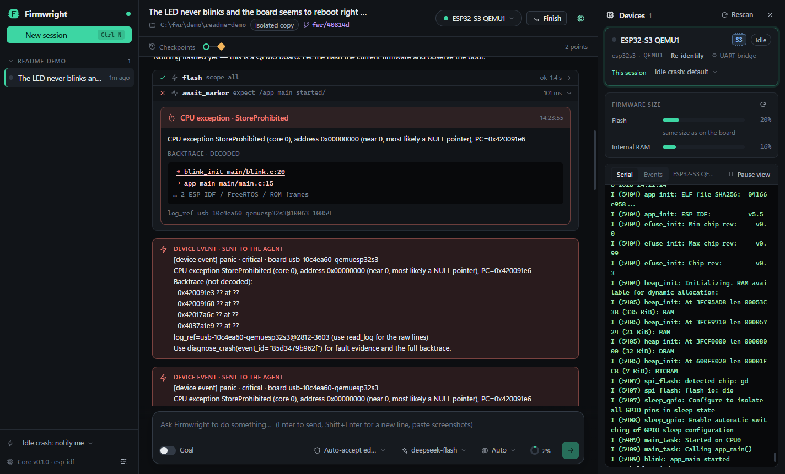
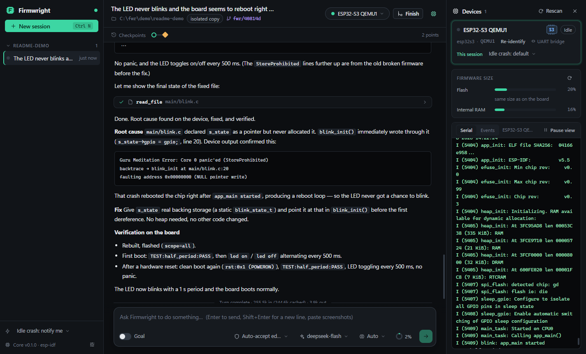
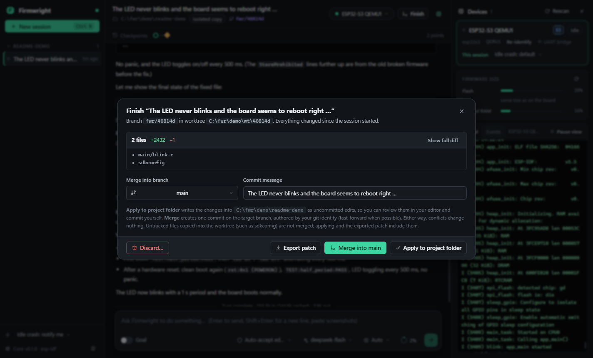
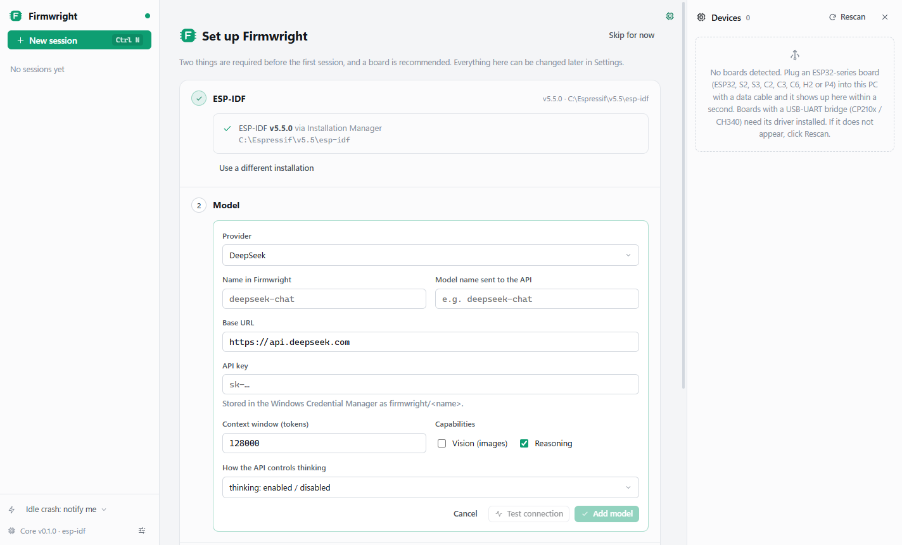

<div align="center">


# Firmwright

### An event-driven desktop agent for embedded development

**The agent builds, flashes, watches the serial port, decodes the crash, and fixes the firmware: on your board, not in a chat window.**

ESP-IDF v5.5 · 8 ESP32 chips · Any OpenAI-compatible model · Windows

<br />

[](https://github.com/san086041-glitch/firmwright/releases/latest)
[](https://github.com/san086041-glitch/firmwright/actions/workflows/ci.yml)


<br />

**[Download](https://github.com/san086041-glitch/firmwright/releases/latest)** ·
[Get started](#get-started) ·
[How it works](#how-it-works) ·
[Evaluation](#how-we-test-it) ·
[Build from source](#build-from-source)

<br />



<sub>A real session: the agent flashes an ESP32-S3, the firmware panics on boot, the crash is decoded to <code>blink.c:20</code> and pushed into the agent's loop.</sub>

<br />

**Your code stays local · Your board stays in the loop · Your model stays replaceable**

</div>

> **Current release: 0.1.0 (Early Preview).** Windows x64 only. The installer is not code-signed yet.

---

## Why Firmwright?

Coding agents are great at editing files. Embedded bugs don't live in files: they live on the board, in a serial log that scrolls by at 115200 baud, in a backtrace full of hex addresses, in a reset that happens 3 seconds after boot.

Firmwright is built around one idea:

> **Give the agent the board, not a screenshot of the log.**

<table>
<tr>

<td width="25%" valign="top">

### Device in the loop

Build, flash, reset and read the serial port are first-class tools, not shell commands the model has to guess.

Every change can be checked on real hardware.

</td>

<td width="25%" valign="top">

### Events, not polling

A crash, a watchdog reset or a reboot loop is turned into an event and pushed into the running agent loop, with the backtrace already decoded.

The agent doesn't have to know where to look.

</td>

<td width="25%" valign="top">

### Verified, not claimed

In Goal mode an independent verifier, with no access to the worker's conversation, flashes the board itself before a goal counts as done.

"It should work now" is not accepted.

</td>

<td width="25%" valign="top">

### Isolated and reversible

Every session works in its own git worktree, with a checkpoint per turn, and the firmware that was flashed at that point is archived too.

Roll back the code and the board together.

</td>

</tr>
</table>

<div align="center">

**It is not a chat window with a serial monitor bolted on.**

### It is an agent whose loop listens to the hardware.

</div>

---

## How it works

Firmwright is a desktop console (Electron + React) on top of a Python agent core. The two talk over [ACP](https://agentclientprotocol.com/) (JSON-RPC over stdio). The agent loop, tools, permissions and device layer are written from scratch, with no agent framework.

```text
   Serial port ──► Log parser ──► Device event ──► Event router
   (per board,      (boot, panic,    (decoded        │
    always on)       WDT, brownout,   backtrace,     ├─ session is working ─► injected into the agent loop
                     reboot loop)     log ref)       │                        (and can interrupt a long wait)
                                                     └─ session is idle ────► crash card + notification,
                                                                              you decide whether the agent handles it
```

- **The serial monitor outlives the task.** Each board is watched from the moment it's plugged in, so a crash 5 seconds after the agent "finished" still reaches you.
- **The model sees a digest, not the firehose.** Events carry a summary and a pointer into the log (`log_ref`); the agent pulls raw lines only when it needs them.
- **Crashes are decoded the same way `idf.py monitor` does it**: `addr2line` on Xtensa, GDB-based unwinding on RISC-V, ROM ELFs included, with ESP-IDF / FreeRTOS frames folded so your code stands out.

<table>
<tr>

<td width="50%">



<p align="center"><sub>Root cause, fix, and on-device verification, including a second clean boot after a hardware reset</sub></p>

</td>

<td width="50%">



<p align="center"><sub>Finish a session: review the diff, merge, apply to your folder, export a patch, or discard</sub></p>

</td>

</tr>
</table>

---

## Three ways to work

<table>
<tr>

<td width="33%" valign="top">

### Agent

**Describe the bug. Let it work.**

The agent reads the project, builds, flashes, watches the board and iterates.

Pick how much it may do on its own: ask before edits, auto-accept edits, or approve all.

</td>

<td width="33%" valign="top">

### Plan

**Investigate before touching anything.**

Read-only mode: the agent studies the code, the logs and the board state and proposes a plan.

Best for unfamiliar projects and risky changes.

</td>

<td width="33%" valign="top">

### Goal

**Define the outcome. Get it verified.**

A planner writes acceptance criteria, the agent works in rounds, and an independent verifier checks each claim on the device.

Stalled rounds are detected from tool results, not from the agent's own account.

</td>

</tr>
</table>

Sub-agents (general, explore, plan) can run in the foreground or in the background, for example "keep watching the serial log while I change the code".

---

## Built for hardware

| | |
| --- | --- |
| **Chips** | All 8 chips officially supported by ESP-IDF v5.5: ESP32, S2, S3, C2, C3, C6, H2, P4 (Xtensa and RISC-V). Chip differences come from one capability table. |
| **Connections** | Native USB-Serial-JTAG, USB-OTG, and USB-UART bridges (CP210x, CH340, FTDI). Boards are recognized by USB serial number or MAC, and re-bound after they re-enumerate. |
| **Many boards, many sessions** | Run several sessions in parallel, each with its own board. Serial and JTAG ports are owned by one session at a time; move a board between sessions in one click. |
| **Firmware awareness** | Flash / IRAM / DRAM usage after every build, and how much the app grew compared with what is on the board. |
| **Hands-on steps** | When the agent needs you to press BOOT, re-plug a cable or check an LED, it asks with a card and waits. |
| **Safe by default** | Writing the bootloader or partition table, erasing flash and `esptool --force` always ask. Burning eFuses never runs, whatever the mode or rules. |
| **No board yet?** | Sessions without a board can still read, edit and build. |

---

## Swap the model, keep the workflow

Firmwright works with **any OpenAI-compatible API that supports tool calling**. Presets are included for:

**DeepSeek · Qwen (DashScope) · GLM (Z.ai) · Kimi (Moonshot) · SiliconFlow · any other compatible endpoint**

Each model is configured on its own: base URL, model name, context window, vision, and how the API controls thinking (each vendor does it differently, and Firmwright maps the effort level to the right parameter). "Test connection" checks that the model really calls tools before you rely on it.

Long sessions don't hit the context wall: when usage passes 80% the conversation is compacted, the full history is archived, and a system-generated snapshot of the hardware state (bound board, last crash, firmware on the board) is attached so nothing important is lost in the summary.

---

## Context that knows embedded

- **Skills**: built-in notes for ESP-IDF, every supported chip (pins, strapping pins, peripherals) and common pitfalls, loaded only when relevant. Add your own `SKILL.md` per project.
- **Project rules**: `.firmwright/rules.md` (or `AGENTS.md`) is read at the start of every session; `.firmwright/facts.toml` tells the verifier what a good boot looks like.
- **Memory**: what the agent learns about your project is kept across sessions and searched with full-text search.
- **Datasheets**: the agent can read PDFs such as a chip's technical reference manual.
- **MCP**: connect any stdio MCP server; with many tools, they're searched instead of all being listed.

---

## Local-first

| Data | Where it lives |
| --- | --- |
| Your project | Untouched until you merge or apply. Agents work in a git worktree. |
| Sessions, checkpoints, archived firmware, memory, settings | `%LOCALAPPDATA%\Firmwright` |
| Agent worktrees | `C:\fwr\wt` (short on purpose for Windows path limits; configurable) |
| API keys | Windows Credential Manager, never in files |
| Firmwright telemetry | None |
| Firmwright account / relay | None |
| Model requests | Sent directly to the provider you configure |

When you use a remote model, the context of the request is sent to that provider, and only to it.

---

## You control the permissions

```text
Agent ─► Tool call ─► Permission layer ─► Allow / Ask / Deny ─► Execution
                         │
                         ├─ your rules:        Tool or Tool(pattern), e.g. shell(idf.py build), flash
                         ├─ hardware risk tiers from the ESP-IDF adapter (dangerous / forbidden)
                         ├─ protected paths:    app data, key files, .env, ~/.ssh
                         └─ outside the project: writes always ask, reads ask outside known areas (ESP-IDF, skills)
```

Deny wins. PowerShell commands are split and checked one by one; outside Approve all, a command that can't be analyzed asks instead of running.

---

## Get started

<table>
<tr>

<td width="25%" valign="top">

### 01

**Install ESP-IDF v5.5**

With Espressif's [Installation Manager](https://docs.espressif.com/projects/esp-idf/en/v5.5/esp32/get-started/windows-setup.html)

</td>

<td width="25%" valign="top">

### 02

**Install Firmwright**

Run the Setup or unzip the portable build

</td>

<td width="25%" valign="top">

### 03

**Connect a model**

Pick a provider, paste a key, test the connection

</td>

<td width="25%" valign="top">

### 04

**Open a project**

Plug in a board, describe the problem, press Enter

</td>

</tr>
</table>

On first launch Firmwright finds your ESP-IDF installation (EIM, the classic installer, or a folder you pick) and walks you through adding a model.

<div align="center">



### [Download Firmwright →](https://github.com/san086041-glitch/firmwright/releases/latest)

</div>

### Packages

| Platform | Architecture | Package |
| --- | --- | --- |
| Windows 10 / 11 | x64 | `Firmwright-Setup-0.1.0.exe` (installer, per-user, no admin rights) |
| Windows 10 / 11 | x64 | `Firmwright-0.1.0-win-x64.zip` (portable) |

**Requirements:** ESP-IDF v5.5 · git · an API key for a model with tool calling.

> The installer is not code-signed yet, so Windows SmartScreen may warn on first launch: choose **More info → Run anyway**.

---

## How we test it

Agent features are easy to demo and hard to prove, so Firmwright is tested with a dedicated evaluation harness (kept separate from this repository):

- **37 tasks** on an ESP-IDF sensor app: boot crashes, crashes that only appear seconds later, watchdog resets, build breaks, timing bugs, goal tasks, long multi-step tasks, and one deliberately unsolvable task.
- **Real firmware on an emulator.** Each run uses QEMU (ESP32-S3), and an independent judge rebuilds and boots the final code itself. The agent's own report is never trusted.
- **Ablations**: every design layer (event injection, interrupts, log digests, compaction, the device check, progress detection, checkpoints) can be switched off, and runs are compared with a baseline that only has the 4 tools of Espressif's official ESP-IDF MCP server, a serial capture and a shell.

---

## Build from source

```powershell
# Python core (3.12+)
cd core
python -m venv .venv
.venv\Scripts\pip install -e .[dev]
.venv\Scripts\python -m pytest

# Desktop
cd ..\desktop
npm install
npm start
```

Package a release (PyInstaller for the core, electron-builder for the app):

```powershell
cd desktop
npm run dist:core   # core\dist\firmwright-core\
npm run dist        # desktop\release\Firmwright-Setup-<version>.exe and the portable zip
```

<details>
<summary><strong>Repository layout</strong></summary>

<br />

| Path | What it is |
| --- | --- |
| `core/firmwright/session` | Agent loop, sub-agents, goal mode (planner, worker, verifier) |
| `core/firmwright/device` | Device manager, serial monitors, event router; simulated and QEMU boards for development |
| `core/firmwright/platform/esp_idf` | ESP-IDF adapter: build, flash, log parsing, crash decoding, chip table, risk rules |
| `core/firmwright/permissions` | Rules engine, PowerShell analysis, protected paths |
| `core/firmwright/workspace` | Git worktrees, checkpoints, firmware archive, merge / apply / patch |
| `core/firmwright/context` | Compaction, skills, memory, PDF reading |
| `core/firmwright/acp` | ACP server: the protocol between core and desktop |
| `desktop/src` | Electron main process and the React console |
| `skills/` | Built-in skills shipped with the app |

</details>

---

## Status

Firmwright 0.1 is an early preview.

- **Windows only.** OS-specific code sits behind one abstraction layer, but macOS and Linux are untested.
- **ESP-IDF only.** Build, flash, decoding and risk rules are behind a platform adapter, so other toolchains (STM32, PlatformIO) can be added later.
- **Hardware coverage:** daily use on an ESP32-S3; the other chips are covered by the capability table and QEMU, not yet by real boards.
- **Models:** OpenAI-compatible APIs only for now. Anthropic, OpenAI Responses and Gemini backends would plug into the same model interface.

Credits: `skills/esp-idf-expert-notes` is imported unchanged from [IoT-SkillsBench](https://github.com/iot-agent/iot-skillsbench) (Apache-2.0, see its `LICENSE`).
